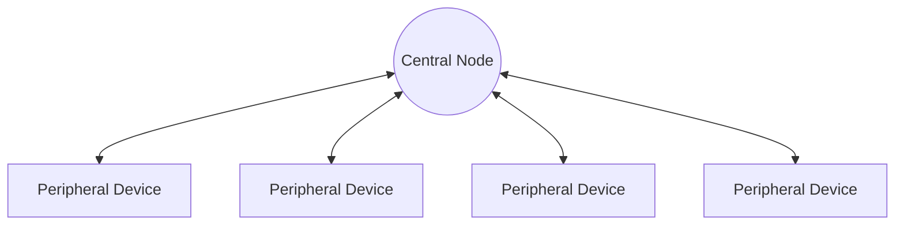
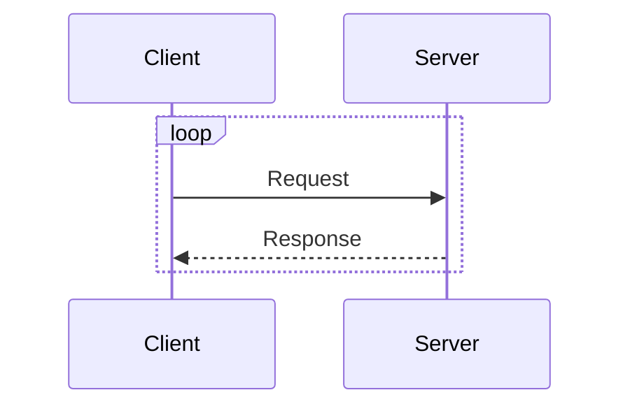

# BLE Generic Attribute Profile (GATT)

<!--toc:start-->

- [BLE Generic Attribute Profile (GATT)](#ble-generic-attribute-profile-gatt)
  - [Central vs. Peripheral](#central-vs-peripheral)
    - [Connected Network Topology](#connected-network-topology)
  - [GATT Transactions](#gatt-transactions)
    - [GATT Client](#gatt-client)
    - [GATT Server](#gatt-server)
  - [Attribute Protocol (ATT)](#attribute-protocol-att)
    - [Profiles](#profiles)
    - [Services](#services)
    - [Characteristics](#characteristics)
    <!--toc:end-->

GATT is the profile that defines how BLE devices transfer data, and uses the
Attribute Protocol (ATT) for storing device data in a 16-bit lookup table with
**Services** and **Characteristics** for each entry.

Once a dedicated connection is made between devices through the BLE GAP
advertising process, data can be transferred between the Central and Peripheral
devices using a Server/Client relationship.

Once the connection is made, the Peripheral device will stop advertising until
the connection is terminated, as it can only connect to one Central device at a time.

## Central vs. Peripheral

A Central device (mobile phone, tablet, computer) can connect to multiple peripherals
which it can write to, and request data from. Once the connection is made, data
can take place in both directions, as opposed to unidirectional advertising the
GAP uses.

### Connected Network Topology

## GATT Transactions

GATT transactions occur as a Server/Client relationship, where the Central
Device is the Client which writes to the Server, sending requests and
receiving asynchronous data.

### GATT Client

The Client initiates all transactions and expects responses from the Server.

### GATT Server

When a connection is established between the Client and Server device,
a connection interval is suggested by the Server. After connecting, the
Client will contact the Server after this period requesting updated data.

This interval may not be fulfilled by the Client due to other network load.

## Attribute Protocol (ATT)

GATT transactions are based on the Attribute Protocol (ATT) which assembles
data in a 16-bit lookup table, and organizes relevant data into Services and
their Characteristics.

### Profiles

Services and Characteristics are organized into pre-defined Profiles that have
been created by the Bluetooth SIG or peripheral designers which capture commonly
used information. Common Profiles include the Heart Rate Profile, and the
Running Speed and Cadence Profile. These profiles can be implemented into products
and contain services that expose relevant characteristics for the peripheral.

#### Services

In the case of a device for User interaction, such as a rechargeable mouse, the
Human Interface Over GATT Profile is commonly used for exposing battery readings,
user input values, and diagnostic information through the server. The profile collects
relevant device data for each of these specific functions into Services. The Client
is able to interact with these Services to retrieve data relevant to the function.

The Client, for example a computer, would connect to a device which has this profile,
and requests data from the Server in relation to the battery reading. The battery
Service may allow the user to request the battery capacity, the charge percentage,
whether the battery is charging or discharging, and any additional details.

These granular values are Characteristics. They can be read from the Server through
Read Operations, pushed from the Server to the Client through Notifications, and
some implementations may allow them to be written for debugging and testing.

#### Characteristics

Characteristics are the single pieces of data grouped together and exposed to
the Client through Services. Each service has a UUID, data, and properties which
define the actions permitted to the Client, such as Read, Write, Notify, and Indicate.
