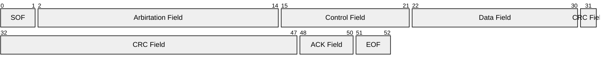
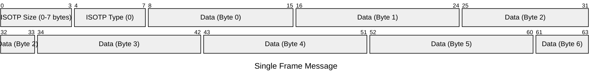
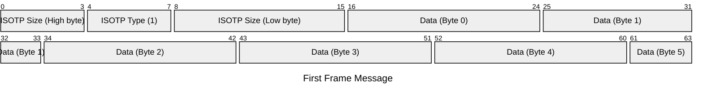
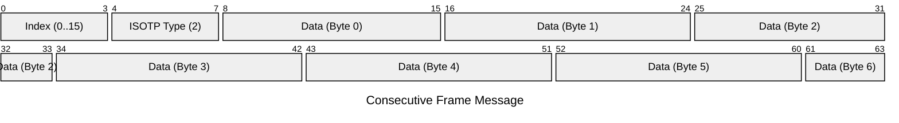
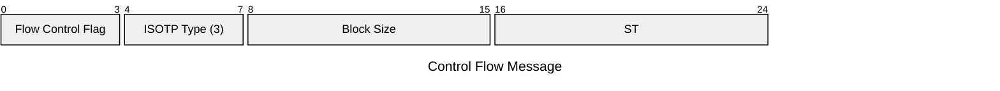
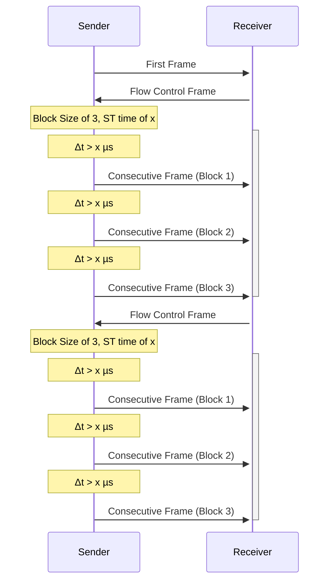
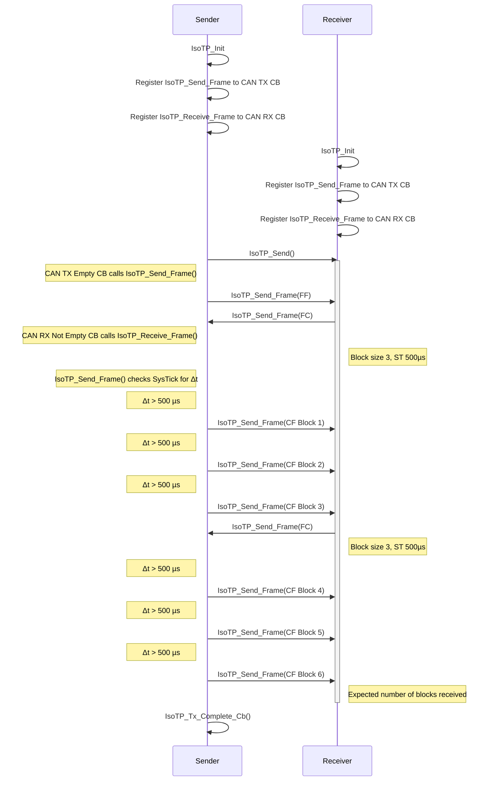
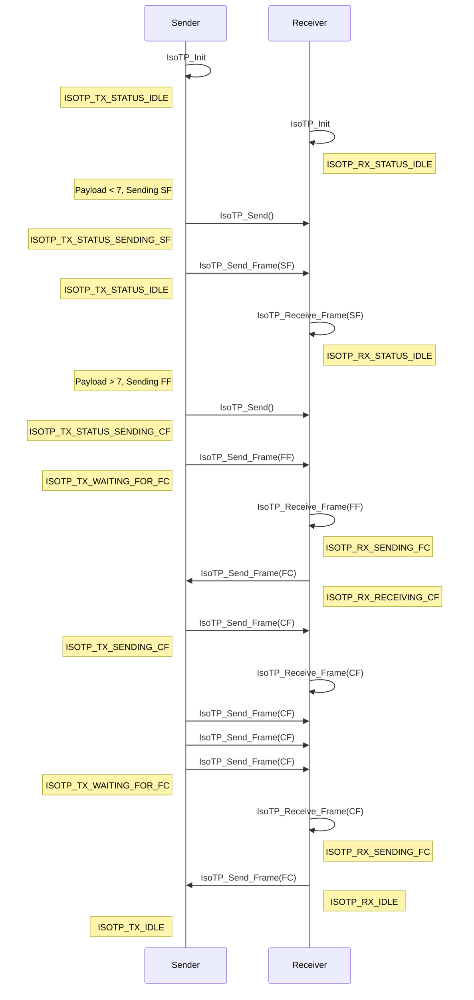

# ISO 15765-2 ISO-TP (Transport Protocol)

<!--toc:start-->

- [ISO 15765-2 ISO-TP (Transport Protocol)](#iso-15765-2-iso-tp-transport-protocol)
  - [Protocol Control Information](#protocol-control-information)
    - [ISO-TP Frame Types](#iso-tp-frame-types)
    - [Padding](#padding)
    - [CAN-TP Header](#can-tp-header)
      - [CAN 2.0A Frame](#can-20a-frame)
      - [ISOTP Data Payload](#isotp-data-payload)
    - [Flow Control](#flow-control)
    - [Sequences](#sequences)
      - [Control Flow Diagram](#control-flow-diagram)
      - [Use Case Example](#use-case-example)
      - [API](#api)
      - [User Shims](#user-shims)
      - [Example Use Case Diagram](#example-use-case-diagram)
      - [Example Use Case Code](#example-use-case-code)
      <!--toc:end-->

[CAN Protocol](protocol-can.md)

Allows for more than 8 bytes of data to be sent over a CAN bus.
Breaks the message into multiple frames with added metadata (CAN-TP Header).

Can carry up to $2^{32}- 1$ bytes of payload.

Most commonly used in diagnostic messages with OBD-2 equipped vehicles.

One or more byte of the 8 byte CAN payload is replaced by metadata,
this is called the _Protocol Control Information_ or PCI, which is
typically 1-3 bytes.

## Protocol Control Information

ISO-TP metadata uses a dynamic size header defined by the first 4 bits of the
header. This Protocol Control Information contains a value declaring the header
to be one of 4 types of PCI headers, as well as the size of the data following
the header.

- Single Frame (SF, first byte is 0x0X)
- First Frame (FF, first byte is 0x1X)
- Consecutive Frame (CF, first byte is 0x2X)
- Flow Control Frame (FC, first byte is 0x3X)

### ISO-TP Frame Types

| Type                   | Code | Description                                                              |
| ---------------------- | ---- | ------------------------------------------------------------------------ |
| Single Frame (SF)      | 0    | A complete payload (7 bytes max)                                         |
| First Frame (FF)       | 1    | Indicates more messages expected, contains the length of the full packet |
| Consecutive Frame (CF) | 2    | Contains the next data                                                   |
| Flow Control Frame     | 3    | The response from the receiver, with [FC Data](#flow-control)            |

### Padding

The data payload in the CAN message can be padded to 8 bytes with arbitrary
values (0xCC, 0xAA, 0x00).

### CAN-TP Header

#### CAN 2.0A Frame



#### ISOTP Data Payload









### Flow Control

| Bit Offset  | 7..4 (byte 0) | 3..0 (byte 0)                     | 15..8 (byte 1)                                                   | 23..16 (byte 2)                                |
| ----------- | ------------- | --------------------------------- | ---------------------------------------------------------------- | ---------------------------------------------- |
| Description | Type          | If the transfer is allowed        | Block Size                                                       | Separation Time (Minimum Delay Between Frames) |
| Single      | Type = 3      | 0 = Continue, 1 = Wait, 2 = Abort | 0 = "Remaining Frames" to be sent before next FC                 | <= 127ms ST                                    |
| Single      | Type = 3      | 0 = Continue, 1 = Wait, 2 = Abort | > 0 = Send number of frames before waiting for the next FC frame | 100-900ms ST                                   |

FC dictates how many frames to send before expecting another FC frame.

### Sequences

#### Control Flow Diagram



#### Use Case Example

##### API

```c
/* Initialize the context object to contain transaction details, and pointers */
int isotp_init(isotp_ctx_t* ctx, uint8_t* rx_buffer, uint8_t* tx_buffer) {
    // ...
}

/* Register the data buffer to the TX buffer created at initialization and set
the transaction parameters to the ctx */
int isotp_send(isotp_ctx_t* ctx, uint8_t* data, uint16_t data_sz) {
    // ...
}

/* Register callbacks for when TX complete, RX complete, etc. */
void isotp_register_cb(isotp_ctx_t* ctx, uint8_t cb_type, (void*) cb) {
    // ...
}

/* This function is called by the user, can be callback or polled to send
the next frame in the send() */
void isotp_send_frame(isotp_ctx_t* ctx, uint8_t* data) {
    // ...
}

/* This function is called by the user, either polled or in callback to receive
any incoming ISOTP frame */
void isotp_receive_frame(isotp_ctx_t* ctx, uint8_t* data) {
    // ...
}
```

##### User Shims

```c
/* required, this must send a single CAN message with the given arbitration
  * ID (i.e. the CAN message ID) and data. The size will never be more than 8
  * bytes. */
int  isotp_user_send_can(const uint32_t arbitration_id,
                          const uint8_t* data, const uint8_t size)
{
    // ...
}

/* required, return system tick, unit is millisecond */
uint32_t isotp_user_get_ms(void)
{
    // ...
}
```

##### Example Use Case Diagram



##### Example Use Case Code

```c
    static isotp_ctx_t isotp;
    static uint8_t isotp_rx_buf[ISOTP_BUFSIZE];
    static uint8_t isotp_tx_buf[ISOTP_BUFSIZE];

    int main(void) {
        /* Initialize CAN */

        /* Register isotp_receive_frame() and isotp_send_frame() to CAN cb */

        isotp_init(&isotp, isotp_rx_buf, sizeof(isotp_rx_buf),
            isotp_tx_buf, sizeof(isotp_tx_buf));

        isotp_send(&isotp, payload, payload_size);

        while(1) {
          /* isotp_send() or isotp_receive() can be used blocking */
        }

        return;
    }

    void CAN_RX_Callback(uint8_t* data, uint8_t data_sz) {
      isotp_receive_frame();
    }

    void CAN_TX_Callback(uint8_t* data, uint8_t data_sz) {
      isotp_send_frame();
    }
```

##### Send-Receive Diagram


