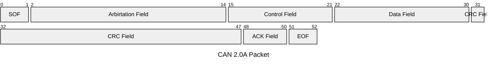

# CAN Protocol (Communication Area Network)

<!--toc:start-->

- [CAN Protocol (Communication Area Network)](#can-protocol-communication-area-network)
  - [Communication](#communication)
    - [Differential Signaling](#differential-signaling)
    - [Arbitration](#arbitration)
  - [Versions](#versions)
    - [CAN 2.0](#can-20)
      - [2.0A](#20a)
      - [2.0B](#20b)
    - [CAN FD](#can-fd)
    - [CAN XL](#can-xl)
    <!--toc:end-->

Originally created as a way to multiplex communication wires in vehicles, CAN
is a multi-master serial bus standard that broadcasts messages across systems
and handles prioritizes messages through arbitration in case of multiple
messages.

CAN Bus is a two-wire differentially wired bus using AND signals, which must
be terminated with resistors to suppress reflections and return the bus to an
idle state. Placing termination resistors, typically 120 Ohms, at both ends
of the bus match the characteristic impedance of the network. These resistors
are connected between the two lines.

## Communication

Each node of a CAN topography requires:

- Central processing unit (Microcontroller)
- CAN controller, often integrated part of the Microcontroller, transmits bits
  onto the CAN bus
- Transceiver, which converts the data stream on the CAN bus to differential
  signals and vice versa

### Differential Signaling

Electrical noise is mitigated by transmitting data using two-line differential
signaling with a differential nominal voltage of 2V. They are either driven to
a dominant state with CANH > CANL, or not driven and pulled to a recessive state
has CANH <= CANL. Dominant states register as 0 when encoded, and recessive
states are encoded as 1.

### Arbitration

Because the system is decentralized, multiple nodes can transmit to the same
target at the same time. In these cases, the message with the lowest ID is
considered to have priority and will transmit first.

CAN messages being transmitted will complete as a message waits for the bus to
be idle, but when transmissions occur at the same time the lower priority
message is superseded by arbitration. It halts and becomes a receiver until
the bus is free or it wins arbitration. No data is lost.

## Versions

### CAN 2.0

Also known as _Classical CAN_ up to 8-byte data payload with a frame that
includes ACK and CRC. Maximum speed is 1 Mbps.

#### 2.0A

Used an 11-bit address identifier.

#### 2.0B

Uses extended 29-bit address identifier.

### CAN FD

_CANFD (Flexible Datarate)_ is an updated version of Classical CAN which can
have data payloads of up to 64 bytes. It also includes enhanced error
detection and maximum speed is 1 Mbps for arbitration and 8 Mbps for data
transfer. Arbitration occurs at a lower data rate to improve communication
stability, while the data is transmitted at a higher rate for greater
throughput.

### CAN XL

_CAN XL (Extra Large)_ is an updated version of CANFD, allowing maximum speeds
of up to 20 Mbps, payloads of 2048 bytes, and advanced addressing.

CANXL adds a 32-bit addressing field and an 8-bit CAN Virtual Network ID for
logical network segmentation.

Supports Ethernet tunneling and integration with higher layer protocols like IP.
