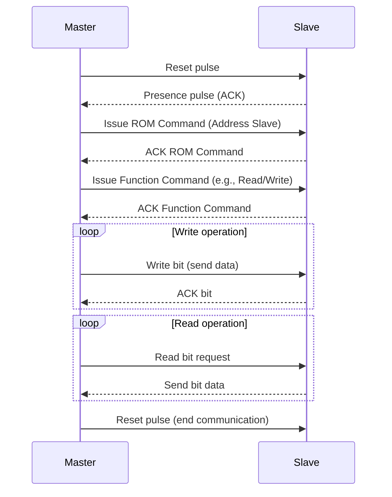

# OneWire

<!--toc:start-->

- [OneWire](#onewire)
  - [Transmission](#transmission)
    - [Signaling](#signaling)
    <!--toc:end-->

The 1-Wire protocol is a low-speed half-duplex proprietary
communication protocol.
Requiring two lines, one for data/power and one for ground,
or three in conventional mode when the data and power lines are separate, 1-Wire
is capable of transmitting up to 200 meters at speeds of up to 16.3 kbps.
1-Wire chips store a unique 64-bit ID code in their ROMs and are commonly used
for low-powered data storage or authentication.

## Transmission

1-Wire communication is driven by a Master which initiates communication with
up to 100 slaves.
The nodes are connected to the Master by open-drain lines, which are high and
brought low by connected devices to communicate in pulsed low signals of
standardized lengths.

### Communication Diagram

### Signaling

In 1-Wire communication there is no clock signal to synchronize the devices,
instead signals depend on communication states and timing.
A 1 bit is defined as a period where the data line is held low for 1-15 μs,
while a 0 bit is when the line is low for 60 μs.
A Master device initiates communication with a slave device by sending a
**Reset Pulse** where the line is pulled low for 480 μs.
The slave responds to this with a **Presence Pulse**, holding the line low for
60 μs.

To read a bit from the slave device, the master pulls the line low for 1-15
μs then releases it, allowing the slave device to pull it low, or do nothing.
If it pulls the line low for 60 μs, the Master reads a 0 bit, else it reads a 1.
